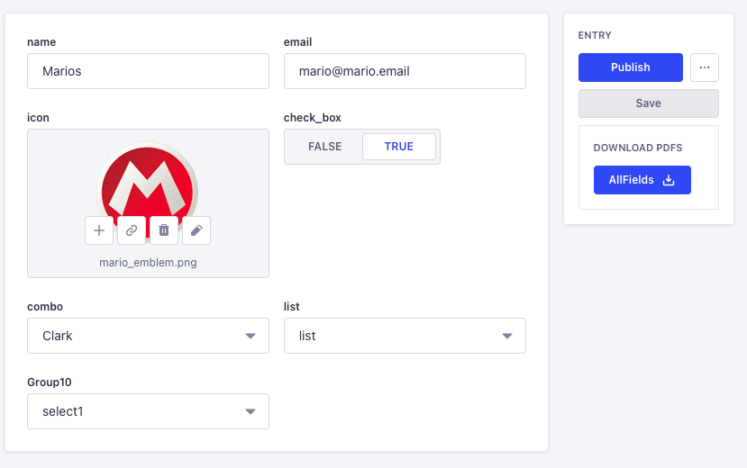

<h1 align="center">
  Strapi PDF Creator Plugin
</h1>

Easily generate PDF documents from your  [Strapi CMS](https://github.com/strapi/strapi) content. 
This plugin will allow you to download a generated PDF file from the Admin panel, or to generate a PDF file programmatically using your own logic.  

PDF generation using [PDF-Lib](https://github.com/Hopding/pdf-lib).

## FYI:

- Generate PDF buttons only appears on edit views.
- Single types content and plugin content are not supported.
- Currently only Super Admin role users can use the logic using the UI.

## ⚠️ Compatibility with Strapi versions

This plugin was developed for the 5.X Strapi version. 
It has not been tested with the 4.X version. Use it at your own risk.

## ⚙️ Installation

To install the Strapi PDF Creator Plugin, simply run one of the following command:

```
npm install @redon2inc/strapi-plugin-pdf-creator
```

```
yarn add @redon2inc/strapi-plugin-pdf-creator
```


## Config

add the following to your `config/plugin.ts`

```javascript
{
  'strapi-plugin-pdf-creator': {
    enabled: true,
    config: {
      permissions: 'none' // coming soon
    }
  },
}
```

## Template requirements

- The PDF template's form field names must match the names as the collection type. Only matching names will be used to populate the files.
- PDF TextFields use Text type fields.
- PDF Buttons will be replaced with Media type fields. _This only when PDFs are flattened._
- PDF Checkboxes use Boolean type fields.
- RadioGroups, OptionLists, Dropdowns fields use Enumeration type fields.

## Usage

### Admin panel

- Once the first template is created and assigned to a collection type, the admin can navigate to an entry and a PDF button should appear on the right side menu.
  
  Check [Examples](./examples/) for more details.

### Create PDF programmatically

You can call the PDF template service from within your code:

```JavaScript
{
  //..

  try{
    const templateBytes = fs.readFileSync('locationOfYourTemplate');
    const docData = {
      name : 'Mario',
      enabled: true,
    }; // field names on the PDF template must match keys
    const templateName = 'Title of Document';
    const flattenDocument = true;
    const documentBytes = await strapi
      .plugin('strapi-plugin-pdf-creator')
      .service('service')
      .createPDF(
        templateBytes,
        docData,
        templateName ,
        flattenDocument,
      );
  } catch (err){
    strapi.log.debug('📺: ', err);
    // ..
  }
  // ..
}
```
Enjoy 🎉

## TODO:

- Security: Allow other roles to generate documents
- Allow other fonts
- Beautify date fields.
- Settings function to validate template against schema.

## 👍 Contribute

1. Add a [GitHub Star](https://github.com/redon2/strapi-plugin-pdf-creator/stargazers) to the project.


## 🧾 License

This plugin is licensed under the MIT License.
