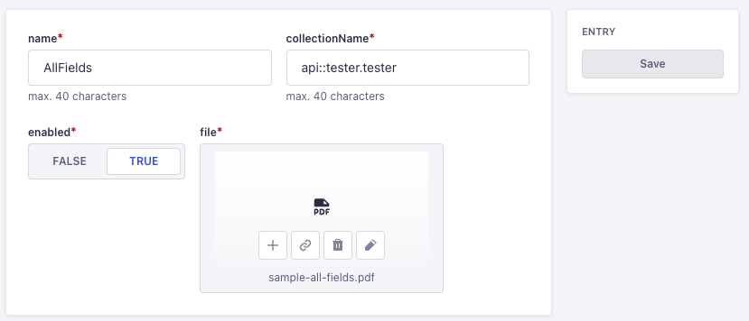

# Testing all possible fields
check the `sample_all_fields.pdf` file in your PDF viewer. The names of the fields need to match to the name of the Content-Types.

You can create a `tester` Type with an empty schema and replace it with the following:

```JSON
{
  "kind": "collectionType",
  "collectionName": "testers",
  "info": {
    "singularName": "tester",
    "pluralName": "testers",
    "displayName": "Tester",
    "description": ""
  },
  "options": {
    "draftAndPublish": true
  },
  "pluginOptions": {},
  "attributes": {
    "name": {
      "type": "string"
    },
    "email": {
      "type": "string"
    },
    "icon": {
      "type": "media",
      "multiple": false,
      "required": false,
      "allowedTypes": [
        "images",
        "files",
        "videos",
        "audios"
      ]
    },
    "check_box": {
      "type": "boolean"
    },
    "combo": {
      "type": "enumeration",
      "enum": [
        "Clark",
        "Kent"
      ]
    },
    "list": {
      "type": "enumeration",
      "enum": [
        "none",
        "list",
        "item1",
        "item2"
      ]
    },
    "Group10": {
      "type": "enumeration",
      "enum": [
        "none",
        "option1",
        "select1",
        "select2"
      ]
    }
  }
}
```
Then create an entry in the `PDF Templates` Collection. where:


- Name: Is the name of the button. 
- collectionName: is the Strapi name of the collection. e.g: `api::tester.tester`
- enabled: this value makes the button enabled/disabled
- file: this is the the connection to the PDF template (use above.)

Once you create your first template, you should be able to see a button section on the right side of the Tester Collection. 

